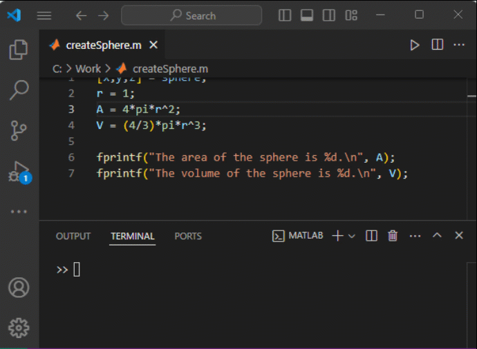
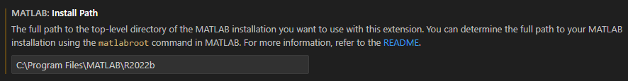

# MATLAB extension for Visual Studio Code
This extension provides support for editing, running, and debugging MATLAB&reg; code in Visual Studio&reg; Code and includes features such as syntax highlighting, code analysis, navigation support, and more. 

You can use this extension with or without MATLAB installed on your system. However, to make use of the advanced features of the extension or run MATLAB code, you must have MATLAB R2021b or later installed. For more information, see the [Get Started](#get-started) section.

**Note:** This extension no longer supports MATLAB R2021a. To use advanced features or run MATLAB code, you must have MATLAB R2021b or later installed.

## Installation
You can install the extension from within Visual Studio Code or download it from [Visual Studio Code Marketplace](https://marketplace.visualstudio.com/items?itemName=MathWorks.language-matlab). After installing the extension, you might need to configure it to make full use of all the features. For more information, see the [Configuration](#configuration) section.

## Get Started
To get started using the extension, open any MATLAB code file (.m), or create a new file and set the language to MATLAB.

### Basic Features (MATLAB not required)
The extension provides several basic features, regardless of whether you have MATLAB installed on your system. These features include:
* Syntax highlighting
* Code snippets
* Commenting
* Code folding


### Advanced Features (requires MATLAB installed on your system)
If you have MATLAB R2021a or later installed on your system, you have access to an additional set of advanced features. These features include:
* Code execution and debugging
* Automatic code completion
* Source code formatting (document formatting)
* Code navigation
* Code analysis, such as continuous code checking and automatic fixes
* Code outline
* Symbol renaming


## Run and Debug MATLAB Code
To run a MATLAB code file in Visual Studio Code, click the Run button at the top of the file. You also can use the `Run File` or `Run Current Selection` commands. When you run the file, output displays in the "Terminal" pane of Visual Studio Code. You also can enter MATLAB code directly in the MATLAB terminal. To stop execution of MATLAB code, press **Ctrl+C**.

To debug a MATLAB code file, add breakpoints to the file by clicking the area to the left of an executable line. Then run the file. Visual Studio Code stops at the first breakpoint. 
When Visual Studio Code is paused, you can use the **Debug toolbar** to peforms debugging actions such as **Continue**, **Step into**, and **Stop**. You also can enter commands in the MATLAB terminal to perform debug actions or change variable values. Use the **Run and Debug** view to see your workspace variables, watch points, and call stack.



### Limitations
There are some limitations to running and debugging MATLAB code in Visual Studio Code:
* Output from timers, callbacks, and DataQueue objects is not shown in the Command Window.
* Creating a custom run configuration for a file is not supported.
* When using the **dbstop** and **dbclear** functions to set and clear breakpoints, the breakpoints are added to file but are not shown in Visual Studio Code.
* Variable values changed in the MATLAB terminal when Visual Studio Code is paused do not update in the **Run and Debug** view until the next time Visual Studio Code pauses.

## Configuration
To configure the extension, go to the extension settings and select from the available options.

### MATLAB Install Path Setting
If you have MATLAB installed on your system, the extension automatically checks the system path for the location of the MATLAB executable. If the MATLAB executable is not on the system path, you may need to manually set the `matlab.installPath` setting to the full path of your MATLAB installation. For example, `C:\Program Files\MATLAB\R2022b` (Windows&reg;), `/Applications/MATLAB_R2022b.app` (macOS), or `/usr/local/MATLAB/R2022b` (Linux&reg;).

You can determine the full path of your MATLAB installation by using the `matlabroot` command in MATLAB. 

For example, run the `matlabroot` command in the MATLAB Command Window.
```
matlabroot
ans =
    'C:\Program Files\MATLAB\R2022b'
```
In the extension settings, set the `matlab.installPath` setting to the value returned by the `matlabroot` command.



### MATLAB Automatically Start Debugger Setting
By default, the extension automatically starts the Visual Studio Code debugger when MATLAB reaches a breakpoint. To disable automatically starting the Visual Studio Code debugger, set the `matlab.automaticallyStartDebugger` setting to `false`. When starting the Visual Studio Debugger is disabled, MATLAB still stops at breakpoints, and you can debug your code in the MATLAB terminal using the MATLAB debugging functions.

### MATLAB Index Workspace Setting
By default, the extension indexes all the MATLAB code files (`.m`) in your current workspace. Indexing allows the extension to find and navigate between your MATLAB code files. 
You can disable indexing to improve the performance of the extension. To disable indexing, set the `matlab.indexWorkspace` setting to `false`. Disabling indexing can cause features such as code navigation not to function as expected.

### MATLAB Connection Timing Setting
By default, the extension starts MATLAB in the background when you open a MATLAB code file in Visual Studio Code. To control when the extension starts MATLAB, set the `matlab.matlabConnectionTiming` setting to one of these values: 
* `onStart` (default) — Start MATLAB as soon as a MATLAB code file is opened.
* `onDemand` — Start MATLAB only when needed for a given action.
* `never` — Never start MATLAB.
Note: Some functionality is available only with MATLAB running in the background.

### MATLAB Max File Size for Analysis Setting
By default, the extension analyzes all files, regardless of their size, for features such as linting, code navigation, and symbol renaming. To limit the maximum number of characters a file can contain, set the `matlab.maxFileSizeForAnalysis` setting. For example, to limit the number of characters to 50,000, set the `matlab.maxFileSizeForAnalysis` setting to `50000`. If a file contains more than the maximum number of characters, features such as linting, code navigation, and symbol renaming are disabled for that file. To remove the limit and analyze all files regardless of their size, set the `matlab.maxFileSizeForAnalysis` setting to `0`.

### MATLAB Show Feature Not Available Error Setting
By default, the extension displays an error when a feature requires MATLAB and MATLAB is unable to start. To not display an error, set the `matlab.showFeatureNotAvailableError` setting to `false`.

### MATLAB Sign In Setting
By default, the extension assumes that the MATLAB installation specified in the Install Path setting is activated.

To enable browser-based sign in to your MathWorks account using the Online License Manager or a Network License Manager, set the `matlab.signIn` setting to true. When this setting is enabled, the extension prompts you to sign in when it starts MATLAB.

### MATLAB Telemetry Setting
You can help improve the extension by sending user experience information to MathWorks&reg;. By default, the extension sends user experience information to MathWorks. To disable sending information, set the `matlab.telemetry` setting to `false`.

For more information, see the [MathWorks Privacy Policy](https://www.mathworks.com/company/aboutus/policies_statements.html).


## Troubleshooting
If the MATLAB install path is not properly configured, you get an error when you try to use certain advanced features, such as document formatting and code navigation.

To resolve the error, set the MATLAB install path to the location of the MATLAB executable. For more information, see the [Configuration > MATLAB Install Path Setting](#matlab-install-path-setting) section.

## Contact Us
We encourage all feedback. If you encounter a technical issue or have an enhancement request, create an issue here or contact MathWorks at support@mathworks.com.

## Release Notes

### 1.3.0
Release date: 2024-12-18
Added:
* Debugging support
* Support for inserting code snippets shipped with MATLAB (requires MATLAB R2025a or later)
* Support for opening additional MATLAB file types (e.g. `.slx`, `.fig`) from the Visual Studio Code context menu (Community contribution from @Gusmano-2-OSU)
 
Fixed:
* Syntax highlighting improvements (Community contribution from @apozharski)

### 1.2.0
Release date: 2024-03-05

Added:
* Code execution support

### 1.1.0
Release date: 2023-06-05

Added:
* Document symbol and outline support

Fixed:
* Code folding no longer matches `end` when used in strings, comments, and to denote the end of a matrix

### 1.0.0
Release date: 2023-04-26

* Initial release.
